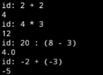
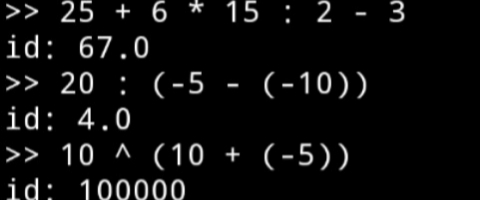

# 🇮🇩 Indo Programming Language

🇬🇧 English below.

Bahasa pemrograman sederhana yang memakai keyword bahasa Indonesia.
Project ini dibuat sebagai sarana belajar membuat interpreter dari nol.

---

A simple interpreted programming language using Indonesian keywords.
This project is built to learn how programming languages work.

> 🚧 This project is under active development.
> Syntax and features may change in future versions.

## 📝 Example

```bash
$ python main.py

>> 25 + 6 * 15 : 2 - 3
id: 67.0
>> 20 : (-5 - (-10))
id: 4.0

```

## 📸 Screenshot

v0.1
<p align="center">
  
</p>

v0.2
<p align="center">
  
</p>

## 📋 Requirements

- Python 3.11+

## ⚙️ Installation

``` bash
git clone https://github.com/Idhmoneys/IDlang.git
cd IDlang
python main.py
```

## ✨ Features

- Interactive REPL
- Lexer
- Parser
- Abstract Syntax Tree (AST)
- Interpreter
- Arithmetic operations
- Unary operators
- Parentheses support
- Runtime error

## 💈 Current Status

The language is currently capable of evaluating arithmetic expressions.

#### ✅ Supported features:

v0.1
- Integer
- Float
- '+ - * :'
- Unary operators
- Parentheses
----
v0.2
- Zero division error
- Runtime error
- Context
- Exponential

## 🛣️ Roadmap

- [x] Lexer
- [x] Parser
- [x] AST
- [x] Interpreter
- [ ] Variables
- [ ] String
- [ ] Boolean
- [ ] If statement
- [ ] Loop
- [ ] Function
- [ ] Lists
- [ ] Dictionaries
- [ ] Module
- [ ] Standard Library
- [ ] Error Traceback

## 🤷‍♂️ Why?

This project was created to learn how programming languages and interpreters work while experimenting with an Indonesian-style syntax.

The long-term goal is to make programming feel more natural for Indonesian speakers.

## ===== PROJECT INFO =====

*Project Name:*\
IDlang

*Made By:*\
[Idhm](https://github.com/Idhmoneys)

*Made With:*\
Python

*Made in:*\
19/07/2026 (20:03:52)

## License

MIT
