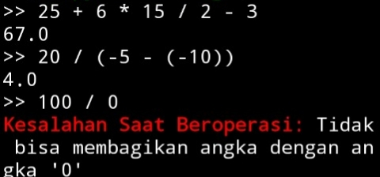
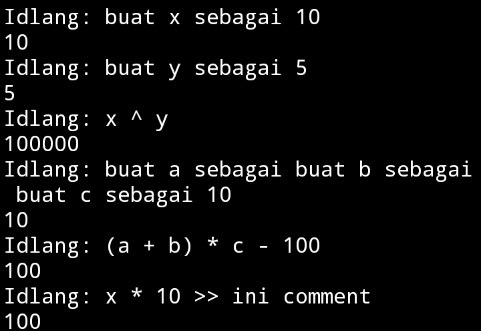
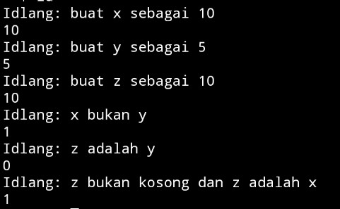

# 🇮🇩 Indo Programming Language

Bahasa pemrograman sederhana dengan sintaks bergaya Bahasa Indonesia.

Proyek ini dibuat sebagai sarana belajar membangun **lexer**, **parser**, dan **interpreter** dari nol menggunakan Python.

> 🇬🇧 This project is primarily documented in Indonesian because the language itself is designed around Indonesian syntax.

> 🚧 **Masih dalam tahap pengembangan.**  
> Sintaks dan fitur dapat berubah sewaktu-waktu.\
> Bantu saya dengan memberikan feedback/saran/masukan

---

## 📝 Contoh

```
idlang: buat x sebagai 10
10
idlang: x bukan kosong
1
idlang: kalau x bukan 0: 10/x selain itu: 10^x
```

---

## 📸 Screenshot

### v0.1.0

<p align="center">
  
</p>

### v0.2.0

<p align="center">
  
</p>

### v0.5.0

<p align="center">
  
</p>

### v0.6.0

<p align="center">
  
</p>

### v0.7.0

<p align='center'>
  
</p>

---

## 📋 Persyaratan

- Python 3.11 atau lebih baru

---

## ⚙️ Instalasi

```bash
git clone https://github.com/Idhmoneys/IDlang.git
cd IDlang
python main.py
```

---

## ✨ Fitur

Saat ini IDlang sudah memiliki:

- REPL interaktif
- Lexer
- Parser
- Operasi aritmatika
- Unary operator
- Prioritas operator
- Tanda kurung
- Runtime Error
- Context
- Variabel
- Operasi perbandingan (`== != < <= > >=`)
- Logika (`benar`, `salah`)
- Operasi Logika (`dan`, `atau`, `bukan`)
- If statement (`kalau`, `selain itu kalau`, `selain itu`)
- Website dokumentasi sederhana

---

## 📈 Progress/Changelog

### v0.1.0

- Lexer
- Parser
- Unary operator
- Operasi aritmatika dasar

### v0.2.0

- Interpreter
- AST
- Runtime Error
- Context
- Operator perpangkatan (^)

### v0.3.0

> ℹ️ v0.3 merupakan hasil penulisan ulang (rewrite) dari proyek sebelumnya.
> Beberapa fitur yang ada di v0.2 kebawah sedang dibangun ulang dengan implementasi yang lebih rapi dan tanpa bergantung pada tutorial.

- Lexer
- Parser
- Unary operator
- Operasi aritmatika dasar

### v0.4.0

> telah berhasil menambah interpreter, sekarang sudah bisa menghitung aritmatika dasar.

- Node
- Value
- AST
- Interpreter

### v0.5.0

> telah membuat error handling, sudah bisa mengatasi division by zero, dll

- Result
- Parse Result
- Runtime Result
- Runtime Error
- No Visit Error
- Syntax Error

### v0.6.0

> membuat perpangkatan, variables, dan bug fixing

- Pangkat (^)
- Variabel
- Context
- Symbol Table

### v0.7.0

> versi kali ini berfokus pada operasi perbandingan dan logika

- Logika ( Benar, Salah )
- Perbandingan ( <= < == != > >= )
- Operasi logika ( tidak, dan, atau )
- Built-in variable ( kosong, benar, salah )

### v0.8.0

> versi ini telah memperindah website dokumentasi dan membuat if statement

- Percantik website (tambah sidebar, animasi, warna yang lebih nyaman, dll)
- Memperbaik type annotation
- Membuat docstring
- Memindah directory file agar lebih bersih
- If statement (kalau, selain itu kalau, selain itu)

Untuk changelog yang lebih lengkap bisa dilihat di **CHANGELOG**

---

## 🛣️ Roadmap

- [x] Lexer
- [x] Parser
- [x] AST
- [x] Interpreter
- [x] Variables
- [x] Boolean
- [x] If Statement
- [ ] String
- [ ] Loop
- [ ] Function
- [ ] Lists
- [ ] Dictionary
- [ ] Module
- [ ] Standard Library
- [ ] Error Traceback

---

## 🤷 Kenapa membuat IDlang?

Awalnya proyek ini dibuat sebagai media belajar membuat bahasa pemrograman.

Namun seiring berjalannya waktu, proyek ini berkembang menjadi eksperimen untuk membuat bahasa pemrograman yang terasa lebih natural bagi penutur Bahasa Indonesia.

---

## 📦 Project Info

**Nama**
IDlang (Indo Programming Language)

**Dibuat oleh**
[Idhm](https://github.com/Idhmoneys)

**Dibuat menggunakan**
Python

**Dimulai pada**
19 Juli 2026

---

## License

MIT